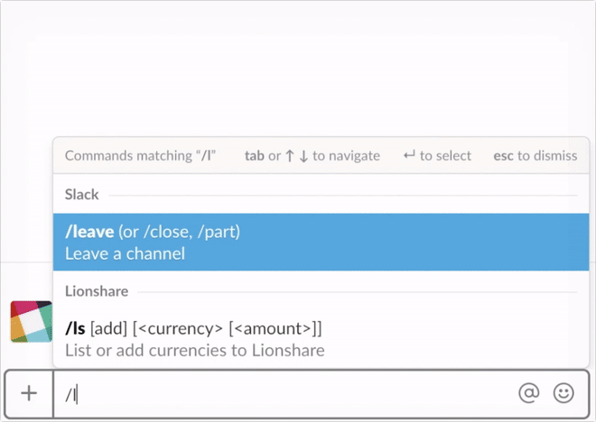
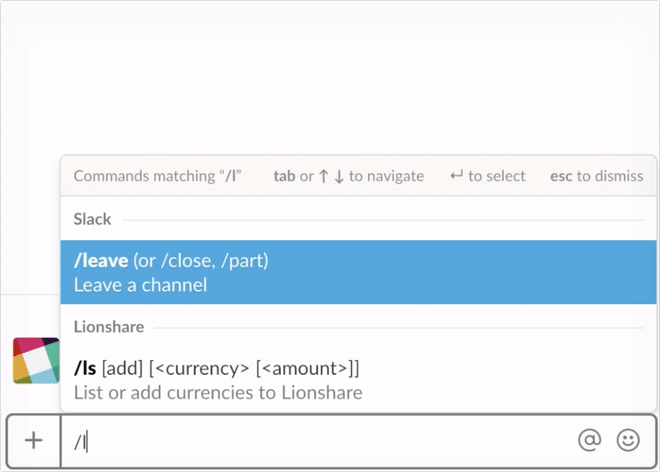

# Lionshare Slack (Beta)

Checking digital currency prices at work has never been easier with the Lionshare slack bot. Lionshare lets you select currencies to follow, report on your daily gains/loses and can display then with the simple `/ls` command.

### Commands

`/ls` which will return a list of the top crypto-currencies and their prices, or the currencies you have selected.

`/ls BTC` will return the price of Bitcoin

`/ls BTC 10` will return the price of Bitcoin calculating your amount

`/ls add BTC` will allow you to track bitcoin and other currencies, now `/ls` will also report on currencies that you are tracking.

`/ls add BTC 2.5` will set the value of your crypto-currency investment and `/ls` will now also return the total value of your assets.

